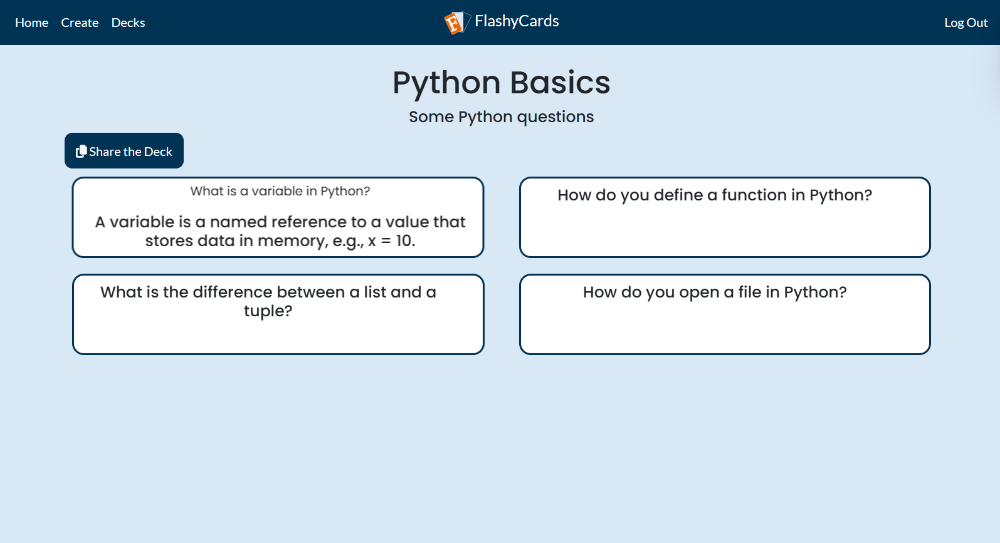

[](https://opensource.org/licenses/MIT)
# **FlashyCards - A Flashcards Learning App**

<div style="text-align: center">
  
</div>

**FlashyCards** is a web application designed for students, educators, and anyone who wants to learn or memorize information using flashcards. It offers a user-friendly interface to create, manage, and interact with flashcards, making studying both productive and engaging.

Key features include the ability to add, edit, and delete flashcards dynamically, responsive layouts for use on any device. The application ensures data consistency and allows users to share and manage their flashcards effectively.

With this application, users can focus more on learning and less on organizing their study material.


## Table of Contents
- [Features](#features)
- [Technologies Used](#technologies-used)
- [Project Structure](#project-structure)
- [Installation](#installation)
- [Usage](#usage)
- [Challenges and Solutions](#challenges-and-solutions)
- [Future Improvements](#future-improvements)
- [License](#license)

## Features
- **Create Flashcards**: Users can create flashcards by entering a question on the front and its answer on the back.
- **Organize Flashcards Into Decks**: Users can group flashcards into decks to keep them organized by topics or categories.
- **User Accounts**: Users can register and log in to save their flashcards and decks.
- **Edit Decks**: Modify the deck name or update flashcards in a deck whenever needed.
- **Share Decks**: Share the link to your deck with others.
- **Review Flashcards**: Flip through the flashcards in a selected deck to study and test your knowledge.

## Technologies Used


- **Frontend**: HTML, CSS, JavaScript
- **Backend**: Flask, Python
- **Database**: SQLite3
- **Styling Tools**:
  - Bootstrap (for styling)
  - FontAwesome (for icons)

## Project Structure
Here is a breakdown of the main files in this project:
- `app.py` : The main flask application that handles routing and logic.
- `templates/` : Contains the HTML templates for the website.
- `static/` : Contains CSS file and images.
- `requirements.txt` : Lists the required Python packages for this project.
- `README.md` : This file, explaining the project and how to use it.

## Installation
### 1. Install Python
Ensure you have Python installed on your system. This project requires **Python 3.7 or later**.  
To check if Python is installed, run:
```bash
python --version
```
If Python is not installed, [download it here](https://www.python.org/downloads/) and follow the installation instructions.
### 2. Clone the Repository
```bash
git clone https://github.com/Markl1T/FlashyCards.git
cd flashycards
```
### 3. Set up a Virtual Environment
```bash
python -m venv venv  
```
```bash
source venv/bin/activate  # On macOS/Linux  
venv\Scripts\activate     # On Windows
```
### 4. Install Dependencies
```bash
pip install -r requirements.txt
```
### 5. Run the Application
```bash
flask run
```
The app will be accessible at http://127.0.0.1:5000/ in your browser.

## Usage
### Create an Account
1. Navigate to the **Register** page
2. Fill out the required information such as the username, email and password
3. Click the **Register** button to create you account


### Log Into Your Account
1. Navigate to the **Log In** page
2. Enter your username/email and password
3. Click the **Log In** button to access your account


### Create a Deck
1. Navigate to the **Create** page
2. Enter a name for your deck
3. Fill the flashcards with questions on the front and answers on the back
4. Click the **+** button to add more flashcards
5. Click the **Save** button to save the deck to your account


### Edit a Deck
1. Navigate to the **Decks** page
2. Locate the deck you want to edit
3. Click the **Edit** button (light blue button with a pencil icon)
4. Update the deck name or modify the flashcards as needed
5. Click the **Save** button to apply the changes


### Delete a Deck
1. Navigate to the **Decks** page
2. Locate the deck you want to delete
3. Click the **Delete** button (red button with a trash icon)
4. A dialog box will appear, asking, "*Are you sure you want to delete this deck?*"
5. Click **Delete** button in the dialog box to confirm


### Review Flashcards
1. Navigate to the **Decks** page
2. Select the deck you want to review
3. Browse through the flashcards in the deck, which will display the questions first
4. Click on a card to flip it and reveal its answer



## Challenges and Solutions
### 1. Flashcard Height
- **Challenge**: The back of a flashcard could contain more text than the front, causing it to overflow beyond the flashcard's boundaries.
- **Solution**: Created a function in JavaScript to find the optimal size for every flashcard based on the space required for their front and back text.
### 2. Deleting Flashcards
- **Challenge**: Deleting a flashcard resulted in gaps in the numbering system and the layout of the flashcards.
- **Solution**: Developed a logic to automatically renumber and reorganize the flashcards to maintain a consistent layout.
### 3. Accidental Deletion
- **Challenge**: Users could accidentally delete decks or flashcards, leading to frustration and lost progress.
- **Solution**: Implemented a confirmation dialog ("*Are you sure you want to delete this deck/flashcard?*") to prevent accidental deletions, giving users a chance to review their action before proceeding.

## Future Improvements
1. Email Verification
2. Statistics & Progress Tracking
3. Theme Customization
4. Spaced Repetition System
5. Badges & Achievements

## License
This project is licensed under the [MIT License](LICENSE).